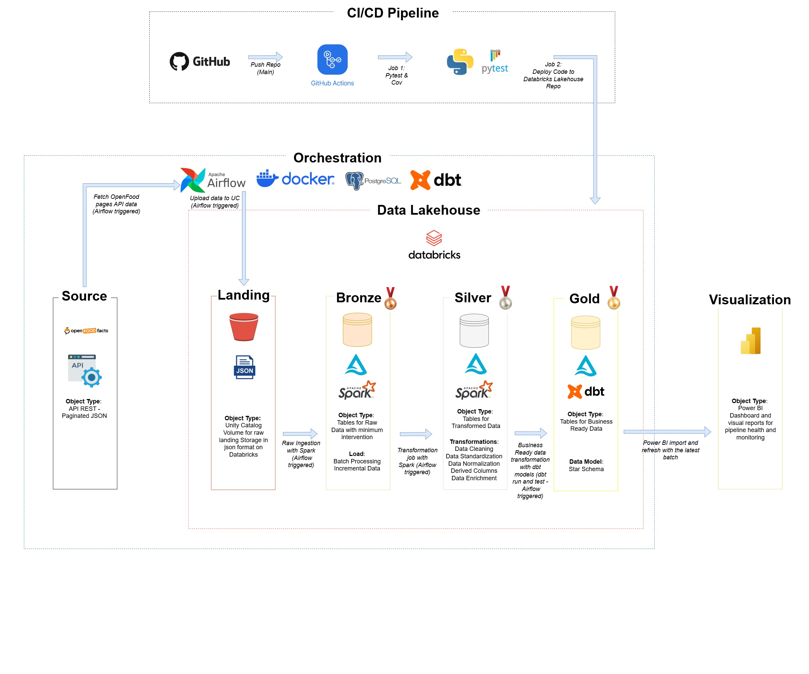
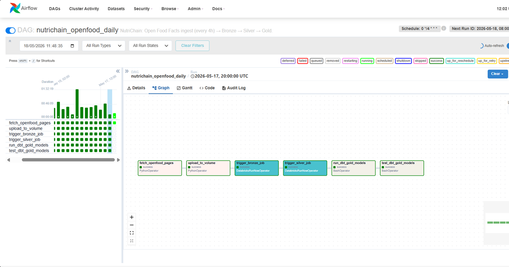
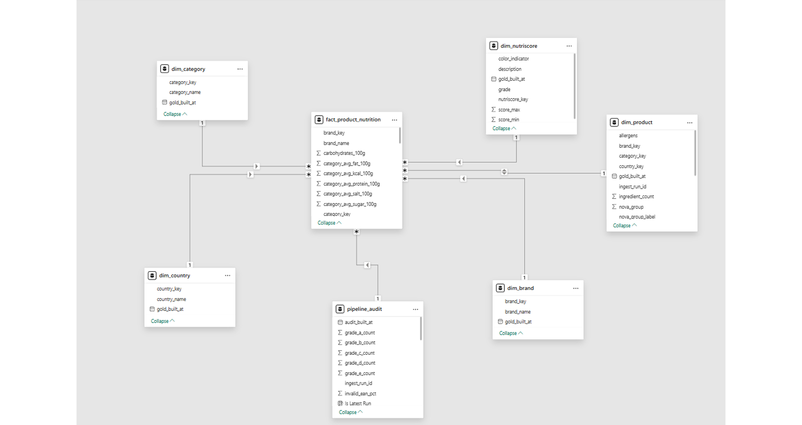
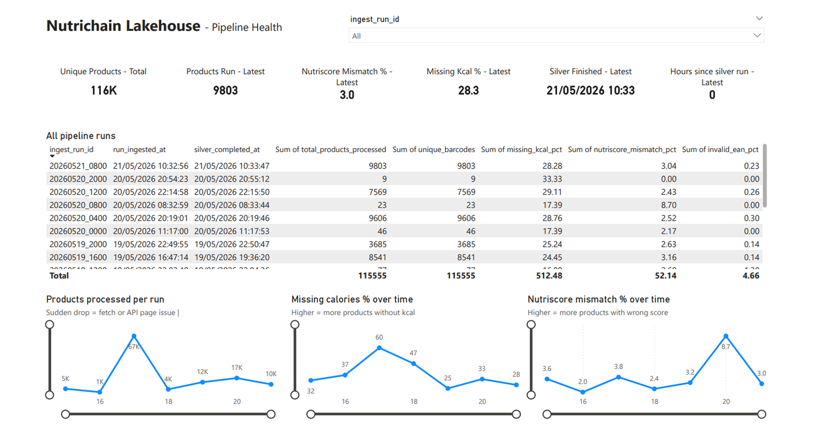
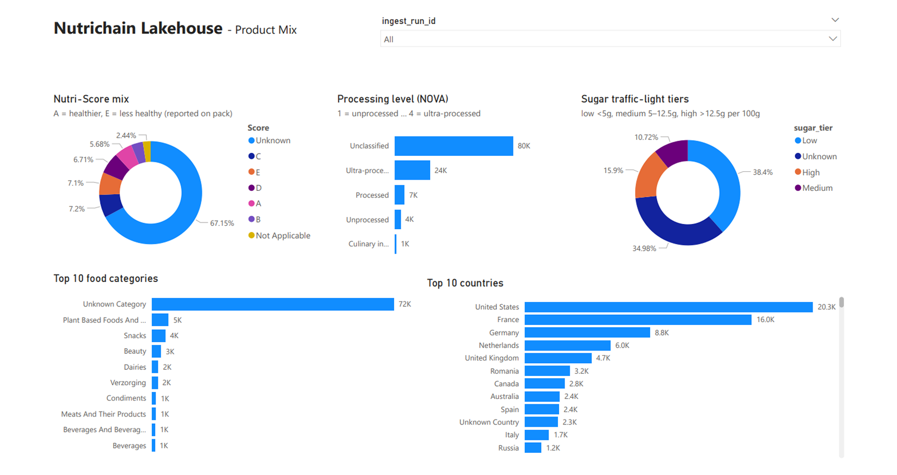
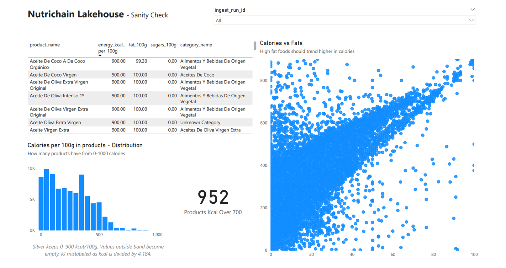
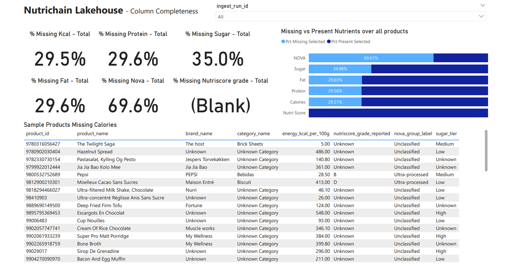

# NutriChain Food Lakehouse

End-to-end batch lakehouse on [Open Food Facts](https://world.openfoodfacts.org/): paginated API ingest, Delta Lake medallion layers on Databricks Unity Catalog, a dbt Gold star schema, and Power BI dashboards for pipeline health and monitoring. Orchestrated with Apache Airflow; delivered to Databricks through GitHub Actions and the Repos API.

# Overview
Portfolio project for **NutriChain Retail Intelligence**: turn crowd-sourced product JSON into typed tables, conformed dimensions, and nutrition facts that category managers can actually use in dashboards. Open Food Facts exposes millions of product records as a paginated REST API. Analysts need stable tables, deduplicated keys, nutrition facts in typed columns, and a star schema — not raw JSON pages.

## Visual overview

End-to-end flow: Open Food Facts API → Airflow orchestration → Databricks medallion layers → Power BI on Gold.

**Architecture** — ingest, lakehouse layers, CI/CD, and consumption.



**Orchestration** — DAG `nutrichain_openfood_daily` (every 4h UTC): fetch → Volume → Bronze → Silver → dbt run/test.



**STAR Schema** — Gold layer dimensions and fact tables



**Power BI** — pipeline health, product mix, sanity checks, and column completeness (Gold + `pipeline_audit`).

| Pipeline health | Product mix |
| :---: | :---: |
|  |  |

| Sanity checks | Column completeness |
| :---: | :---: |
|  |  |


NutriChain closes that gap:

- **Ingest** paginated API pages from Airflow (outbound HTTP stays off Databricks serverless).
- **Land** JSON on a Unity Catalog Volume, then load **Bronze** Delta with run metadata.
- **Clean and enrich** in **Silver** with PySpark (dedup, casts, derived fields).
- **Model** **Gold** with dbt (dimensions, `fact_product_nutrition`, `pipeline_audit` for ops dashboards).
- **Validate** with pytest (fetch/upload) and dbt tests (schema + custom SQL checks).
- **Deploy** Databricks job code via Repos API sync on push to `main`.

Bounded pagination (`OPENFOOD_MAX_PAGES`) and a persisted page offset (`OPENFOOD_PAGINATION_STATE_PATH`) let each scheduled run advance through the catalog instead of re-fetching page 1 every time.

| Area | What you can review in the repo |
|------|--------------------------------|
| Ingestion | Paginated REST client with retries, polite delay, and cross-run page offset |
| Orchestration | Single Airflow DAG chaining fetch → Volume → Databricks jobs → dbt |
| Lakehouse | Bronze raw JSON, Silver PySpark cleanse/enrich, Gold dbt models on Delta |
| Data quality | pytest on Python modules; dbt schema + custom SQL tests on Silver/Gold |
| Ops / delivery | `pipeline_audit` for run health; CI runs tests and syncs code to Databricks Repos |
| Consumption | Power BI report wired to Gold (including audit metrics) |

**Stack:** Python 3.12 · Apache Airflow 2.9 · PySpark (Databricks) · Delta Lake · Unity Catalog · dbt 1.8 · GitHub Actions · Power BI


---

## Pipeline flow

Open Food Facts blocks or throttles outbound calls from many hosted Spark environments. External HTTP stays in **Airflow** (Docker on your machine). Databricks reads landed files from a UC Volume and runs Spark + dbt SQL only.

```
Open Food Facts API (paginated JSON)
              │
              ▼
┌─────────────────────────────────────────┐
│  Airflow (Docker Compose, local)      │
│  DAG: nutrichain_openfood_daily       │
│  schedule: every 4 hours (UTC)        │
└─────────────────┬───────────────────────┘
                  │
    fetch → upload → bronze job → silver job → dbt seed/run → dbt test
                  │
                  ▼
┌─────────────────────────────────────────┐
│  Databricks Unity Catalog               │
│  Volume  → Bronze Delta → Silver Delta  │
│            → Gold Delta (dbt)           │
└─────────────────┬───────────────────────┘
                  ▼
            Power BI (SQL / Import)
```

**Pagination:** `OPENFOOD_PAGINATION_STATE_PATH` stores the next API page between runs so scheduled jobs advance through the catalog instead of re-pulling page 1. `OPENFOOD_MAX_PAGES` caps work per run (tune for API limits and Databricks cost).

**Delivery:** On push to `main`, GitHub Actions runs `pytest`, then `PATCH /api/2.0/repos/{DATABRICKS_REPO_ID}` so the Git-backed Databricks Repo matches `main`. Job notebooks must live under `/Repos/...`, not legacy `/Shared` imports.

Architecture diagrams: [docs/architecture/](docs/architecture/) (Draw.io source + exported JPG). Airflow screenshot: [docs/screenshots/nutrichain_airflow_dag_graph.png](docs/screenshots/nutrichain_airflow_dag_graph.png). Dashboard PNGs: [powerbi/](powerbi/).

---

## Repository layout

```
nutrichain-food-lakehouse/
├── airflow/
│   ├── docker-compose.yml       # Local Airflow + Postgres + dbt mount
│   ├── Dockerfile
│   └── dags/openfood_bronze_dag.py
├── src/openfood/
│   ├── config.py                # Required env loaders 
│   ├── fetch.py                 # API client
│   ├── pagination.py            # Page offset between runs
│   └── upload.py                # UC Volume upload
├── databricks/
│   ├── bronze/bronze_ingestion.py
│   └── silver/
│       ├── silver_transform.py  # Incremental MERGE or --backfill_all
│       ├── silver_cleaning.py   # Casting, dedup, enrichment helpers
│       └── data/country_alias_lookup.csv
├── dbt/
│   ├── models/gold/             # dims, fact_product_nutrition, pipeline_audit
│   ├── models/silver/           # ephemeral bridge + sources.yml
│   ├── seeds/                   # nutriscore_grade_lookup.csv
│   └── tests/                   # Custom SQL data-quality tests
├── tests/                       # pytest (fetch, upload, pagination, silver cleaning)
├── scripts/
│   └── generate_country_alias_lookup.py
├── powerbi/
│   ├── pipeline-health-dashboard.pbix
│   └── *.png                         # Dashboard exports for README / portfolio
├── docs/
│   ├── architecture/
│   └── plan/openfood-nutrichain-project-plan.md
├── .github/workflows/ci_cd.yml
├── env.example.txt              # Copy to .env (gitignored)
└── requirements.txt
```

Gold is **dbt-only** (no PySpark Gold job). Silver is built in Databricks; dbt declares `source('silver', 'silver_openfood_products')` and materializes Gold on top.

---

## Gold data model

Star schema centered on `fact_product_nutrition` (one row per product per snapshot date):

| Model | Role |
|-------|------|
| `dim_product` | Product attributes, NOVA group, data quality tier |
| `dim_brand`, `dim_category`, `dim_country` | Conformed dimensions |
| `dim_nutriscore` | Grades A–E via seed `nutriscore_grade_lookup` |
| `fact_product_nutrition` | Nutrition measures per 100g, foreign keys to dims |
| `pipeline_audit` | Per-`ingest_run_id` volume and quality KPIs for monitoring |

dbt passes `--vars '{"run_date": "<logical date>"}'` from Airflow for snapshot dating on facts.

---

## Getting started

### Prerequisites

- Docker Desktop
- Databricks workspace with Unity Catalog, SQL warehouse, and a **Databricks Repo** linked to this GitHub repository
- Two Databricks jobs (Bronze + Silver notebooks) with IDs stored in `.env` and Airflow Variables

## Usage

### Pagination across runs

Each successful fetch advances `next_page_start` in `OPENFOOD_PAGINATION_STATE_PATH` (default under `/tmp/nutrichain_openfood/`). Docker Compose mounts a named volume `openfood_state` at that path so three-hourly runs do not restart at page 1.

`OPENFOOD_MAX_PAGES` caps how many pages one run requests; increase it for larger batches (watch API rate limits and Databricks cost).

### dbt locally (optional)

Run from the `dbt/` directory only. Use `dbt/profiles.yml` with `env_var()` for Databricks credentials (file is gitignored; see `dbt/profiles.yml` pattern in repo docs).


---

## Testing and data quality

| Layer | Coverage |
|-------|----------|
| Python | `tests/test_fetch.py`, `test_upload.py`, `test_pagination.py`, `test_fetch_pagination.py`, `test_silver_cleaning.py` |
| dbt schema | `not_null`, `unique`, `relationships`, `accepted_values` on Gold (`dbt/models/gold/schema.yml`) and Silver source (`dbt/models/silver/sources.yml`) |
| dbt custom | `dbt/tests/` — energy kcal ranges, sugar tier validity, barcode EAN share, category benchmark bounds, etc. |
| CI | `pytest` on every push/PR; Repos sync on `main` after tests pass ([`.github/workflows/ci_cd.yml`](.github/workflows/ci_cd.yml)) |

GitHub Actions secrets for delivery: `DATABRICKS_HOST`, `DATABRICKS_TOKEN`, `DATABRICKS_REPO_ID`.
Workflow: [.github/workflows/ci_cd.yml](.github/workflows/ci_cd.yml)

---

## Documentation

| Path | Contents |
|------|----------|
| [docs/plan/openfood-nutrichain-project-plan.md](docs/plan/openfood-nutrichain-project-plan.md) | Business context, layer design, success metrics |
| [docs/architecture/](docs/architecture/) | Draw.io source and exported diagram |
| `env.example.txt` | Full environment variable list |

---

## Verifications

| Check | Expected |
|-------|----------|
| Bronze | Rows with `ingest_run_id` for the triggered batch |
| Silver | Unique `barcode` / product keys; enrichment columns populated |
| Gold | dbt run completes; tests pass |
| Airflow | DAG run success, no failed upstream tasks |
| Pagination | `pagination_state.json` shows increasing `next_page_start` across runs |

## Known constraints

- **Bounded ingest:** `OPENFOOD_MAX_PAGES` limits pages per run; use `--backfill_all` on Silver to re-apply cleansing to all Bronze already loaded.
- **API etiquette:** Set `OPENFOOD_USER_AGENT` with contact info; tune `OPENFOOD_POLITE_DELAY_SECONDS` for rate limits.
- **Databricks Free tier:** Fair-use compute; larger page counts increase runtime and cost.

## License

Portfolio / educational use. Add a `LICENSE` file if you fork for redistribution.
